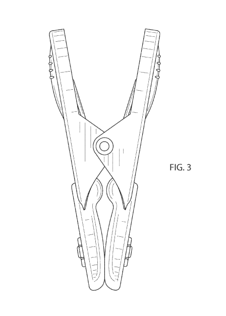
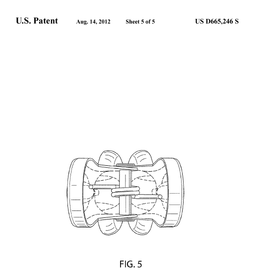

# A1 – Build Your Professional Portfolio

## Objective

## Analyze
### Task A: Portfolio Analysis  
1. Jacob V. Shankel's [Portfolio](https://github.com/jshank523/jvs-portfolio)  
    a. Jacob's portfolio is well organized, with each project being separated into its own bubbles. His portfolio can be found instantly on the homepage.  
    b. These documents do not contain enough information to be able to reproduce these projects, as they are very concise and may lead a colleague to ask questions.  
    c. Some projects do show some decisions made, but all projects show final results.  
    d. The portfolio is very professional and can be handed over to an employer.  

2. Thanh Tran's [Portfolio](https://thanhvtran.com/)  
    a. Thanh's portfolio is easy to navigate as it shows his experiences and projects on the homepage.  
    b. These documents do not contain enough information to be able to reproduce these projects, as they are very concise and may lead a colleague to ask questions. However, this portfolio has many more pictures.  
    c. These projects do not show any decisions made and only show the final results.  
    d. The portfolio is very professional and can be handed over to an employer.  

### Task B: Product Analysis  
#### a. Primary Function
The primary function of a spring-action clothespin is to apply a sustained compressive clamping force between opposed jaws, utilizing static friction and mechanical interlocking to secure an object against external loads.

#### b. Governing Model

##### i. Model and Variables
Behavior is governed by the **Static Equilibrium of a First-Class Lever** combined with **Hooke’s Law for Torsion Springs** ($\tau = \kappa\theta$). For the clamp to hold, the internal torque generated by the spring must equal the opposing torque of the clamping force at the jaws.

The governing equation is:

$$ F_{c} = \frac{\kappa \cdot \theta}{L_{jaw}} $$

* **$F_{c}$** = The resultant clamping force exerted at the jaws.
* **$\kappa$** = The torsional spring constant of the metallic coil.
* **$\theta$** = The angular displacement of the spring from its resting, untorqued state.
* **$L_{jaw}$** = The distance from the fulcrum (pivot point) to the point of contact at the clamping jaws.

##### ii. Assumption
**Rigid Body Assumption:** The lever arms are perfectly rigid and do not elastically bend under the spring's compressive load, ensuring 100% of the generated torque transfers to the clamping point.

#### c. Component Geometry and Mechanical Function

The geometry of the lever arm features an elongated handle on one side of a central semi-circular cutout (which acts as the fulcrum seat) and a clamping jaw on the other. The elongated handle provides a mechanical advantage, amplifying the torque generated by the user's fingers to easily overcome the spring's high resistance. The inner face of the jaw features concave, grooved cutouts (scallops). This specific geometry allows the jaws to physically interlock around cylindrical objects (like a clothesline) rather than relying exclusively on surface friction against a flat plane.

This component consists of a central helical coil with two extended, straight tines (legs). The central coil's geometry dictates its ability to store elastic potential energy when subjected to torsion. Its inner diameter is precisely sized to seat over the semi-circular cutouts of the joined lever arms, locking the three pieces together and serving as the physical pivot point (fulcrum). The extended tines are geometrically straight so they can lie flat against the exterior tracks of the lever arms, distributing the intense torsional force of the coil as a linear, dispersed compressive load across the rigid levers without puncturing the material.

#### d. Patent Research

*   **Patent Number:** [US D665246 S](https://patentimages.storage.googleapis.com/95/5d/88/ab2fa3a7e58fd4/USD665246.pdf)
*   **Inventor(s):** Jean-Claude Laguelle

##### i. Alternative Solutions
1.  **Binder Clip:** Utilizes a single piece of bent spring steel acting as a continuous leaf spring to generate a compressive clamping force, rather than using a distinct coil spring and two separate rigid levers.
2.  **Traditional One-Piece Peg (Slotted Clothespin):** A single rigid wooden or plastic peg featuring a tapered slot. It relies entirely on the elastic deflection of the peg's material and friction to wedge an object into place, eliminating moving parts altogether.

##### ii. Design Decision
A key engineering decision is the inclusion of multiple scallops (concave cutouts) of varying radii on the inner jaws. This allows the device to stably seat objects of vastly different diameters (e.g., thin wire vs. thick rope). These specific seats prevent lateral slipping, which would inevitably occur with perfectly flat jaw faces.

## Decide

## Communicate

