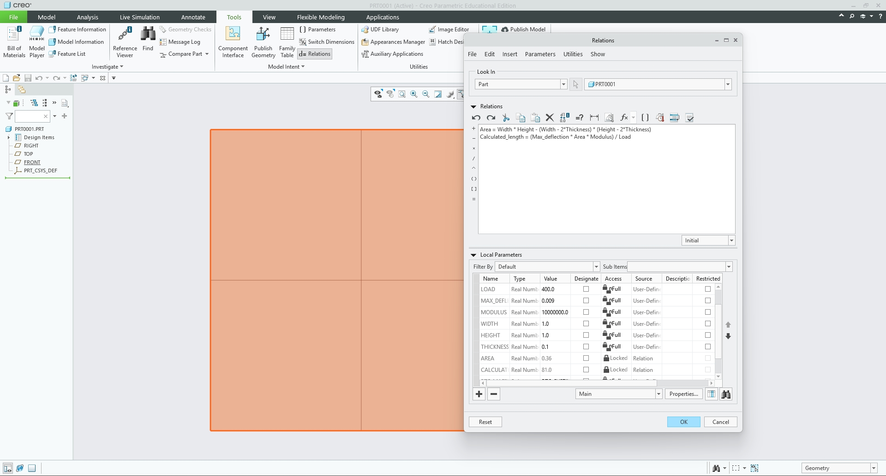
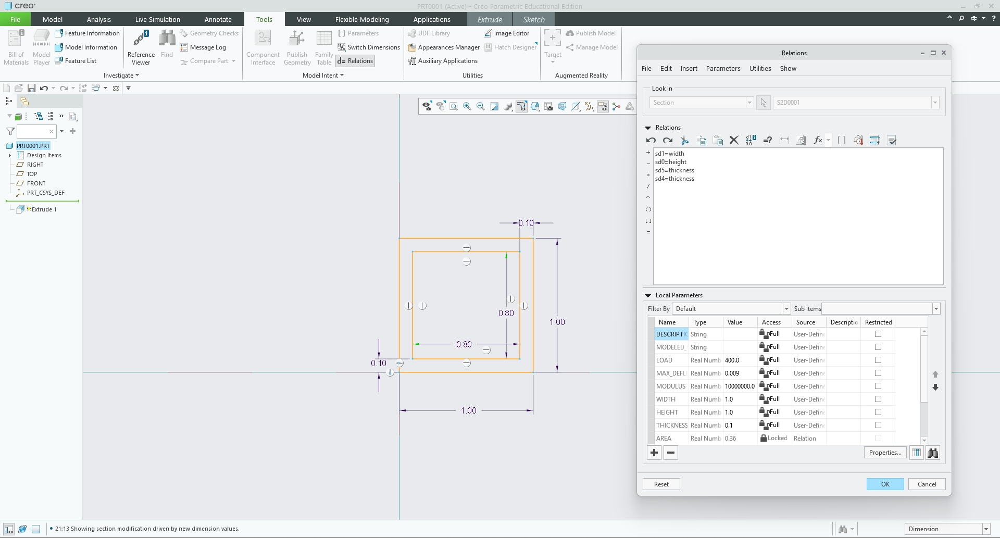
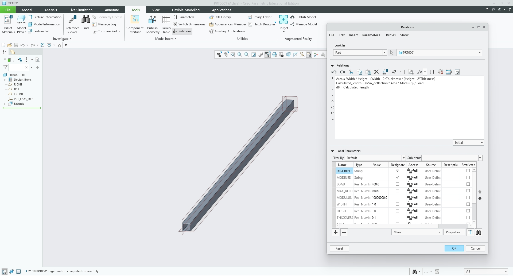
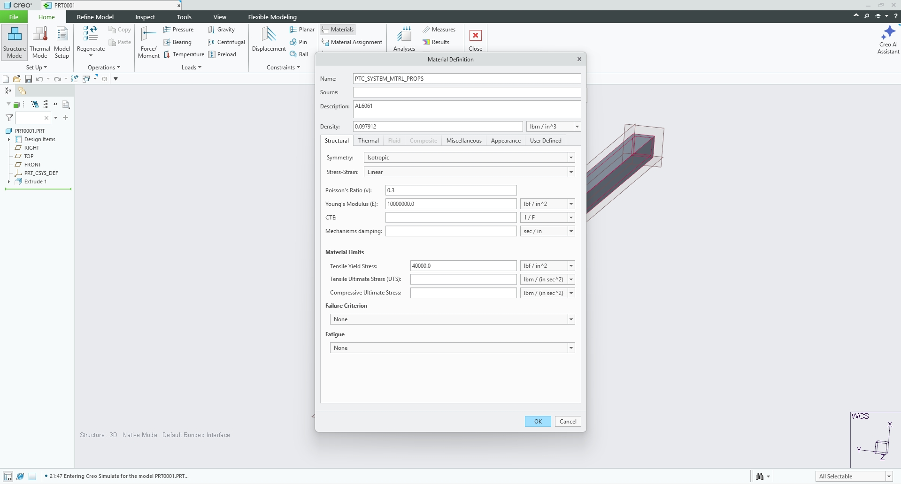
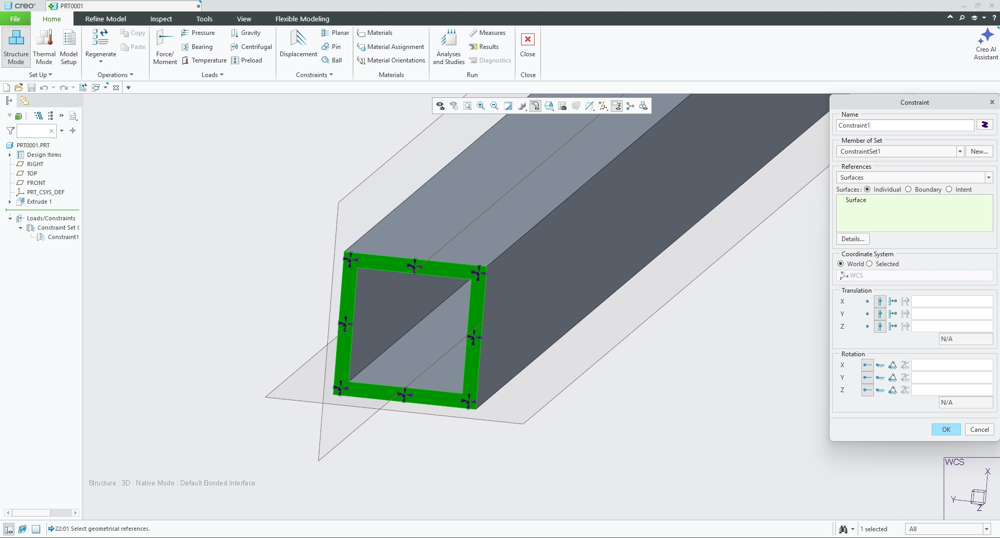
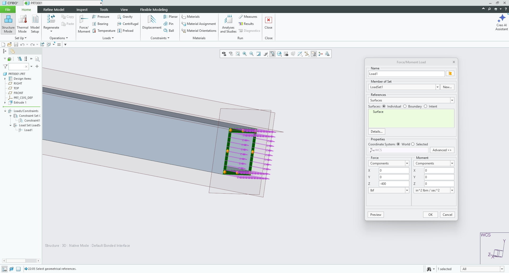
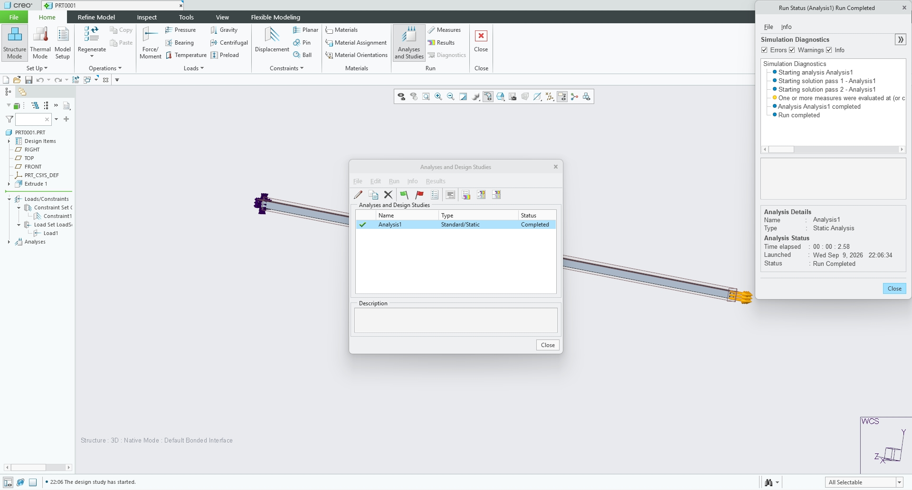
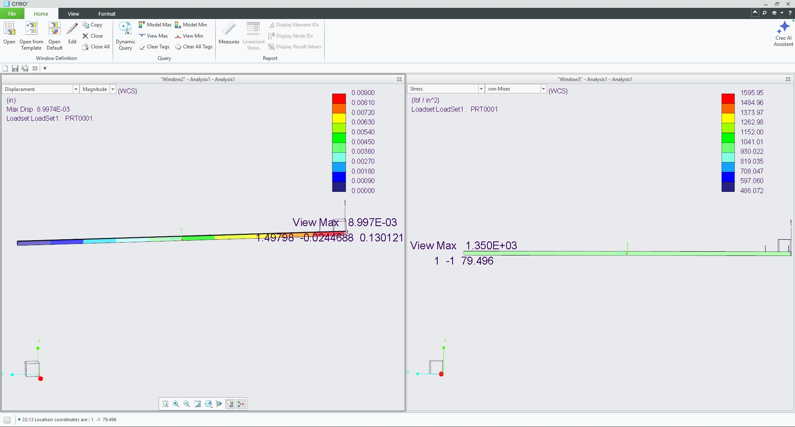

# Portfolio Assignment – Cantilevered Hollow Box Beam

<small>***(Clicking on the images will enlarge them)***</small>

[Download my Creo CAD Part File (.prt) Here](Insert_CAD_Google_Drive_Link_Here)  
[Download my Scanned Hand Calculations & Written Work PDF Here](Insert_PDF_Link_Here)

## 1. Parametric Design & Geometry Setup
For this assignment, I needed to figure out the minimum length of a bar under direct tension using parametric equations, making sure the axial deflection didn't exceed 0.009 inches. The assignment description mentioned a "circular cross section," but the rubric strictly graded on designing a "cantilever hollow box beam" and defining width, height, and thickness. To hit the rubric's requirements, I went with a square hollow structural section (HSS). 

I set my applied direct load ($P$) to 400 lbf, which safely fit within the 300 - 500 lbf requirement. I used Aluminum, so my Young’s Modulus ($E$) was $10 \times 10^6\text{ psi}$ and my Yield Strength ($S_y$) was 40 ksi. For the dimensions, I chose a width ($w$) of 1.0", a height ($h$) of 1.0", and a thickness ($t$) of 0.1".

First, I calculated the cross-sectional area of my hollow box beam by subtracting the inner void from the outer profile:
$$A = (1.0)(1.0) - (0.8)(0.8) = 0.36\text{ in}^2$$

Next, I used the direct tension elongation equation from the Machinery’s Handbook ($\delta = \frac{P L}{A E}$) and rearranged it to solve for the maximum allowable length ($L$):
$$L = \frac{0.009\text{ in} \cdot 0.36\text{ in}^2 \cdot 10,000,000\text{ psi}}{400\text{ lbf}} = 81\text{ inches}$$

## 2. CAD Implementation & Parameter Relations
I built the model in Creo Parametric by tying my hand-calculation variables directly into the software's relations tool so the geometry would update dynamically if I ever changed a base value.

### Step 1: Defining Parameters & Relations
First, I opened a new part file (IPS units) and went to **Tools > Parameters**. I created my core variables: `LOAD` (400), `MAX_DEFLECTION` (0.009), `MODULUS` (10000000), `WIDTH` (1.0), `HEIGHT` (1.0), and `THICKNESS` (0.1). Then, under **Tools > Relations**, I typed in the equations to compute `AREA` and `CALCULATED_LENGTH` automatically.

  <figure style="display: inline-block; margin: 10px; vertical-align: top;">
    
    <figcaption style="font-size: 0.85em; color: gray; margin-top: 5px;">
      Parameters table and relations computing the 81-inch length
    </figcaption>
  </figure>

### Step 2: Sketching the Profile & Mapping Dimensions
To build the beam, I sketched concentric rectangles on the Front plane. While still in sketch mode, I opened the relations tab and linked the raw sketch dimensions (`sd1`, `sd0`, `sd5`, `sd4`) directly to my `WIDTH`, `HEIGHT`, and `THICKNESS` parameters.

  <figure style="display: inline-block; margin: 10px; vertical-align: top;">
    
    <figcaption style="font-size: 0.85em; color: gray; margin-top: 5px;">
      Mapping sketch dimension symbols to design parameters
    </figcaption>
  </figure>

### Step 3: Extrusion and Regeneration
I extruded the section profile and linked the extrusion depth dimension (`d8`) to my `Calculated_length` parameter. When I regenerated the model, it snapped to the exact calculated 81-inch length.

  <figure style="display: inline-block; margin: 10px; vertical-align: top;">
    
    <figcaption style="font-size: 0.85em; color: gray; margin-top: 5px;">
      Extrusion feature linked to Calculated_length parameter
    </figcaption>
  </figure>

## 3. Finite Element Analysis (FEA) Verification
To prove my math worked, I moved over to **Applications > Simulate** to test the beam under load.

### Step 1: Material Definition
First, I created a custom AL6061 material with a density of $0.097912\text{ lbm/in}^3$, Young's Modulus of $10,000,000\text{ lbf/in}^2$, and Poisson's ratio of 0.3. I set the Tensile Yield Stress to 40,000 lbf/in^2.

  <figure style="display: inline-block; margin: 10px; vertical-align: top;">
    
    <figcaption style="font-size: 0.85em; color: gray; margin-top: 5px;">
      Custom AL6061 Material Properties Setup in Creo Simulate
    </figcaption>
  </figure>

### Step 2: Applying Constraints and Loads
For my constraints, I used the Displacement tool on the root face of the beam and locked all translations to "Fixed". Then, using the Force/Moment tool, I applied a 400 lbf tensile load pulling outward on the opposite tip face.

  <figure style="display: inline-block; margin: 10px; vertical-align: top;">
    
    <figcaption style="font-size: 0.85em; color: gray; margin-top: 5px;">
      Fixed displacement constraint on root face
    </figcaption>
  </figure>
  <figure style="display: inline-block; margin: 10px; vertical-align: top;">
    
    <figcaption style="font-size: 0.85em; color: gray; margin-top: 5px;">
      400 lbf tensile force applied to tip face
    </figcaption>
  </figure>

### Step 3: Running the Analysis & Results
After executing the static analysis study, the run completed successfully. 

  <figure style="display: inline-block; margin: 10px; vertical-align: top;">
    
    <figcaption style="font-size: 0.85em; color: gray; margin-top: 5px;">
      Static analysis run diagnostics and completion status
    </figcaption>
  </figure>

Reviewing the results windows, the displacement contour map showed a maximum axial deflection of **$8.997 \times 10^{-3}\text{ in}$**, and the von Mises stress map indicated a peak stress of **$1.35 \times 10^3\text{ psi}$** at the fixed root constraint.

  <figure style="display: inline-block; margin: 10px; vertical-align: top;">
    
    <figcaption style="font-size: 0.85em; color: gray; margin-top: 5px;">
      Displacement contour (left) and von Mises stress distribution (right)
    </figcaption>
  </figure>

With a peak stress of 1.35 ksi and Aluminum's yield strength sitting at 40 ksi, I calculated my safety factor:
$$SF = \frac{40\text{ ksi}}{1.35\text{ ksi}} = 29.6$$
The structure is well below the yield limit and incredibly safe.

## 4. Design Reflection & Analytical Comparison
My hand-calculated deflection was 0.009000 inches, and my FEA result was 0.008997 inches. That is a difference of only 0.033%. 

The results are basically identical, but the tiny 0.033% difference happens because my 1D hand calculation assumes perfect, uniform elongation across the whole beam. In Creo Simulate, the "Fixed" boundary constraint physically prevents the root face from shrinking inward (Poisson's contraction). This artificial restriction makes the root slightly stiffer in the simulation. This same restriction is why my FEA peak stress (1350 psi) was slightly higher than my theoretical nominal stress ($\sigma = 400 / 0.36 = 1111\text{ psi}$).

For overall elongation in direct tension, I trust my parametric hand-calculation because it's immune to mesh-dependency and boundary artifacts. However, for localized stress evaluations near supports or complex geometry, I'd rely entirely on the FEA.

If I drilled a 0.2" pin hole through the 1.0" flat face, the $d/w$ ratio would be 0.2. According to Peterson’s Stress Concentration Factors, a flat bar in tension with this ratio has a stress concentration factor ($K_t$) of roughly 2.5. The hole would reduce my net area to $0.32\text{ in}^2$, bumping my nominal net stress to 1250 psi. The estimated peak stress right at the edge of the hole would jump to 3.125 ksi. Even with this stress concentration, 3.125 ksi is way below the 40 ksi yield limit, leaving me with a comfortable safety factor of 12.8.

## 5. Lessons Learned & Time Tracking
This was a great exercise in setting up smart, parametric CAD models before actually sketching anything. Early on, I made a decimal placement error in my hand calculations that output an 8.1-inch length instead of 81 inches. Catching that math error before setting up the relations table saved me a lot of CAD troubleshooting later. 

I also learned a lot about how material definitions work in Creo. When inputting the custom AL6061 material limits, I realized that choosing "Convert Value" actually changes the baseline number. I had to go back and explicitly select "Interpret Value" to force the software to keep my 40,000 psi limit exactly where I typed it. Finally, seeing the FEA peak stress hit 1350 psi at the wall instead of the theoretical 1111 psi taught me a lot about how fixed faces restrict Poisson contraction and artificially induce localized multi-axial stresses that 1D textbook math ignores completely.

**Time Spent:**
*   Hand Calculations & Parameter Setup: 45 minutes
*   CAD Relational Modeling & Linking: 45 minutes
*   FEA Setup, Material Assignment, & Runs: 45 minutes
*   Portfolio Documentation: 45 minutes
*   **Total Time:** 3 hours

## Resources
All design, simulation, and documentation work was done using:

<ul style="list-style-type: circle !important; padding-left: 20px;">
  <li style="list-style-type: circle !important; margin-bottom: 4px;">
    PTC Creo Parametric
  </li>
  <li style="list-style-type: circle !important; margin-bottom: 4px;">
    PTC Creo Simulate
  </li>
  <li style="list-style-type: circle !important; margin-bottom: 4px;">
    Machinery's Handbook (Equations & Stress Concentration Factors)
  </li>
</ul>
