# A4: Motor Mount Design
**Student:** Randy Hoang

<small>***(Clicking on the images will enlarge them)***</small>

## 1. Parametric Design & Geometry Setup
For this assignment, I designed a high-rigidity L-bracket motor mount to secure a $\Phi 28\text{ mm}$ planetary gearbox with a $\Phi 6\text{ mm}$ shaft ($18\text{ mm}$ length). The design had to support a $300\text{ N}$ applied load while keeping the maximum bending deflection under $0.30\text{ mm}$ using PLA material ($E = 3500\text{ MPa}$, $S_y = 50\text{ MPa}$) with a safety factor of $SF = 3$.

### Feature 1: Vertical Faceplate Bending
Using the cantilever beam deflection formula ($\delta = \frac{P L^3}{3 E I}$), I rearranged to solve for the required Area Moment of Inertia ($I$):
$$I \ge \frac{300\text{ N} \cdot (50\text{ mm})^3}{3 \cdot 3500\text{ MPa} \cdot 0.30\text{ mm}} = 11,904\text{ mm}^4$$

With a chosen bracket width ($b$) of $42\text{ mm}$ to accommodate the motor and side gussets, I solved for the required plate thickness ($t$):
$$I = \frac{b t^3}{12} \implies \frac{42 t^3}{12} = 11,904 \implies t = 15.04\text{ mm}$$
I rounded up to a nominal thickness of **$t = 16\text{ mm}$**, yielding a final moment of inertia $I = 14,336\text{ mm}^4$, a maximum deflection of $0.24\text{ mm}$, and a peak bending stress of $8.37\text{ MPa}$ (well below the $16.67\text{ MPa}$ allowable limit).

### Feature 2: Horizontal Base Plate & Bolt Tension
To calculate the prying force pulling the rear mounting bolts out of the floor, I evaluated the overturning moment ($M = P \cdot L = 15,000\text{ N-mm}$) across a bolt leverage distance ($d$) of $35\text{ mm}$:
$$F_t = \frac{M}{d} = \frac{15,000\text{ N-mm}}{35\text{ mm}} = 428.5\text{ N}$$
The base plate thickness was set to $10\text{ mm}$ to safely anchor M3 hardware without crushing.

---

## 2. CAD Implementation & Parameter Relations
I built the model in PTC Creo Parametric by linking my calculations directly into parametric relations so the geometry updates dynamically.

### Step 1: Defining Parameters & Relations
I opened **Tools > Parameters** and established core variables: `WIDTH` (42), `VERT_THICK` (16), `BASE_THICK` (10), and `L_HEIGHT` (65).

  <figure style="display: inline-block; margin: 10px; vertical-align: top;">
    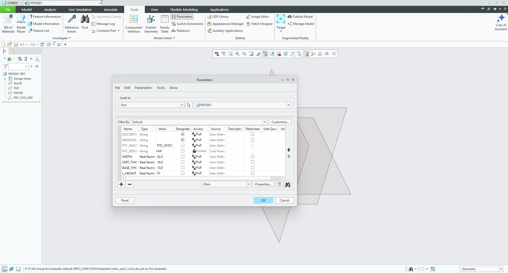
    <figcaption style="font-size: 0.85em; color: gray; margin-top: 5px;">
      Core global parameters set up in Creo
    </figcaption>
  </figure>

### Step 2: Sketching the L-Profile
I sketched the L-shape on the Right Plane, mapping sketch dimensions directly to my parameters (`VERT_THICK`, `BASE_THICK`, `L_HEIGHT`).

  <figure style="display: inline-block; margin: 10px; vertical-align: top;">
    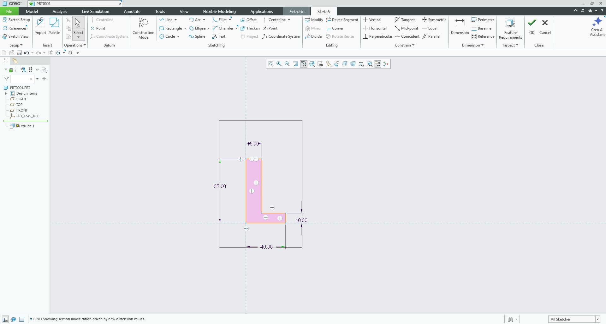
    <figcaption style="font-size: 0.85em; color: gray; margin-top: 5px;">
      Fully dimensioned base L-profile sketch
    </figcaption>
  </figure>

### Step 3: Symmetric Extrusion
I extruded the profile using a **Symmetric** depth option tied to the `WIDTH` parameter ($42\text{ mm}$).

  <figure style="display: inline-block; margin: 10px; vertical-align: top;">
    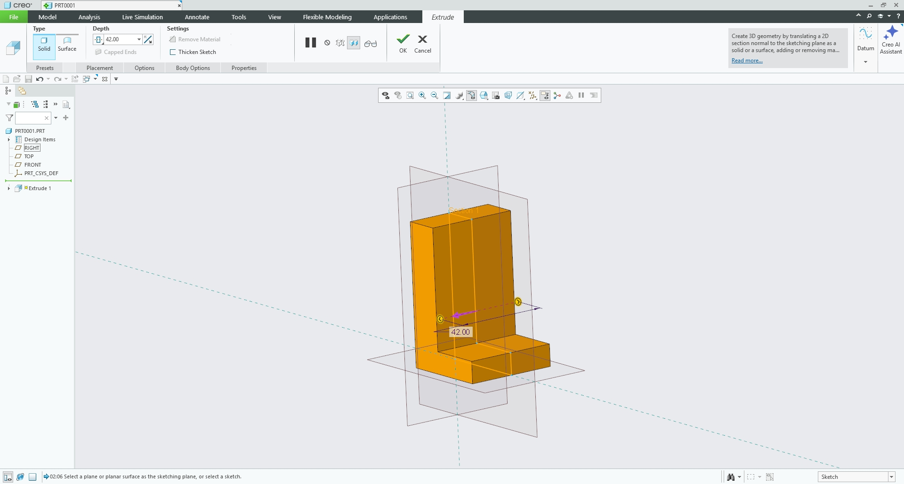
    <figcaption style="font-size: 0.85em; color: gray; margin-top: 5px;">
      Symmetric extrusion across the 42 mm width
    </figcaption>
  </figure>

### Step 4: Motor Recess Counterbore Sketch & Cut
To accommodate the $18\text{ mm}$ motor shaft within the $16\text{ mm}$ wall, I sketched a $29\text{ mm}$ circle at ($X=21\text{ mm}$, $Y=45\text{ mm}$) on the back face and cut it to a depth of $12\text{ mm}$.

  <figure style="display: inline-block; margin: 10px; vertical-align: top;">
    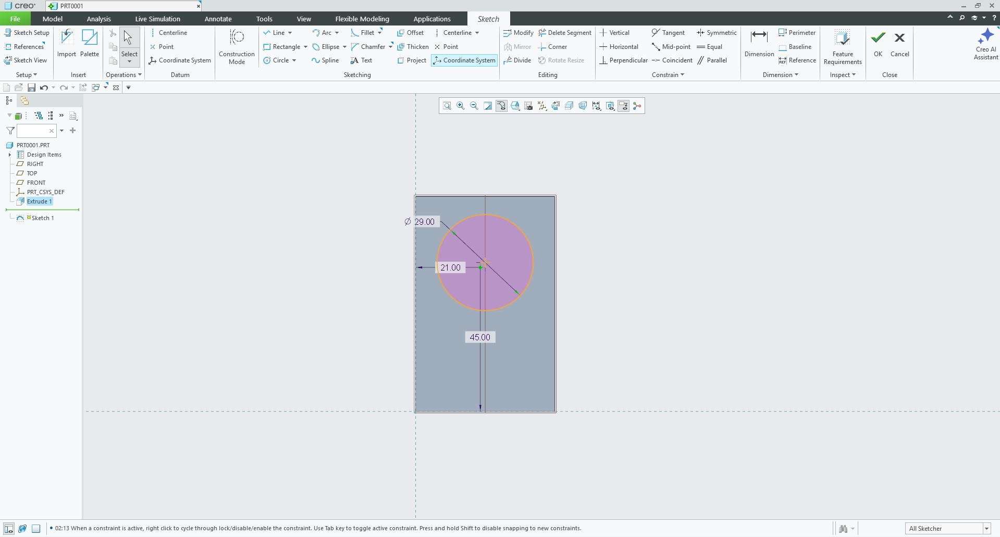
    <figcaption style="font-size: 0.85em; color: gray; margin-top: 5px;">
      Sketching the 29 mm motor recess pocket
    </figcaption>
  </figure>
  <figure style="display: inline-block; margin: 10px; vertical-align: top;">
    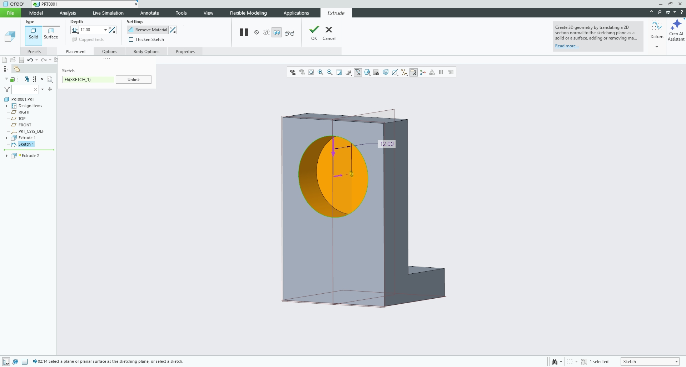
    <figcaption style="font-size: 0.85em; color: gray; margin-top: 5px;">
      12 mm deep counterbored pocket cut
    </figcaption>
  </figure>

### Step 5: Shaft Clearance & Diagonal Mounting Hole Pattern
On the floor of the recess pocket, I added a $6.5\text{ mm}$ central shaft hole and a $16\text{ mm}$ construction circle holding four diagonal $3.4\text{ mm}$ holes for M3 screws, cutting them **Through All**.

  <figure style="display: inline-block; margin: 10px; vertical-align: top;">
    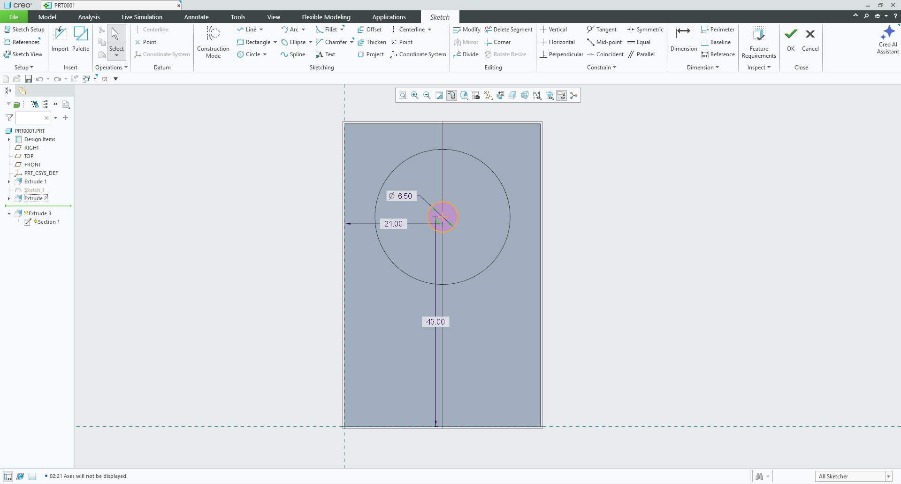
    <figcaption style="font-size: 0.85em; color: gray; margin-top: 5px;">
      Diagonal hole pattern on 16 mm construction circle
    </figcaption>
  </figure>
  <figure style="display: inline-block; margin: 10px; vertical-align: top;">
    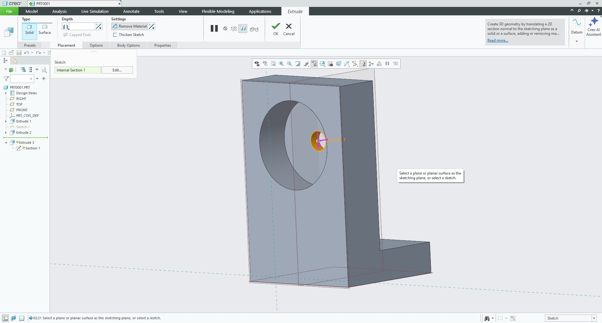
    <figcaption style="font-size: 0.85em; color: gray; margin-top: 5px;">
      Through-all cuts exiting the front face
    </figcaption>
  </figure>

### Step 6: Base Mounting Slots
I added two $3.4\text{ mm}$ wide mounting slots to the horizontal base plate and cut them through all.

  <figure style="display: inline-block; margin: 10px; vertical-align: top;">
    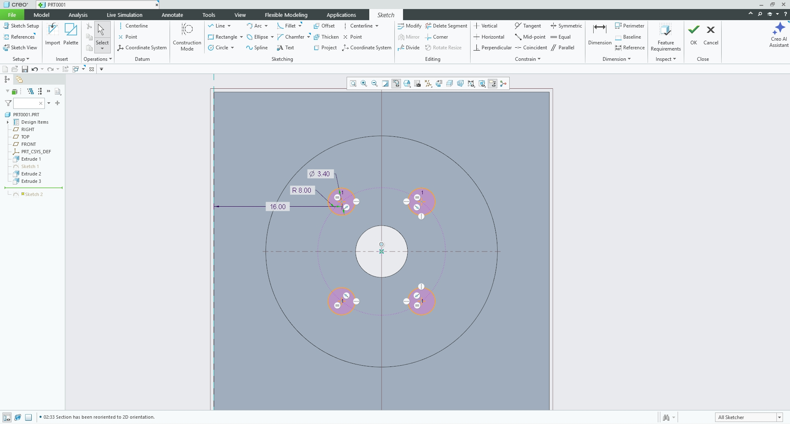
    <figcaption style="font-size: 0.85em; color: gray; margin-top: 5px;">
      Slotted floor mounting holes on the base plate
    </figcaption>
  </figure>

### Step 7: Gussets and Fillets
To drastically increase corner rigidity, I added $4 \times 4\text{ mm}$ triangular gussets to both inner sides using the Mirror tool, and applied $2\text{ mm}$ rounds to internal sharp corners.

  <figure style="display: inline-block; margin: 10px; vertical-align: top;">
    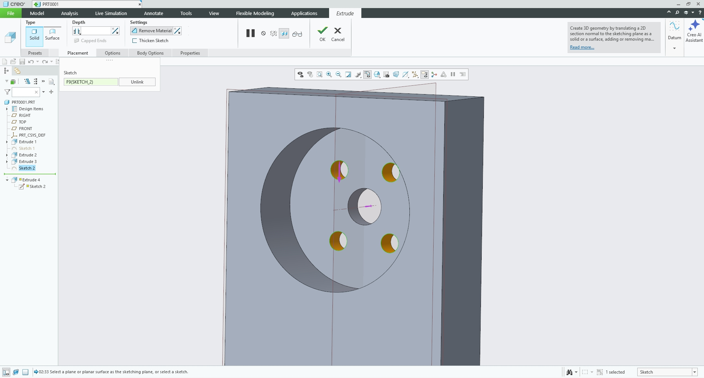
    <figcaption style="font-size: 0.85em; color: gray; margin-top: 5px;">
      4x4 mm triangular gusset profile
    </figcaption>
  </figure>
  <figure style="display: inline-block; margin: 10px; vertical-align: top;">
    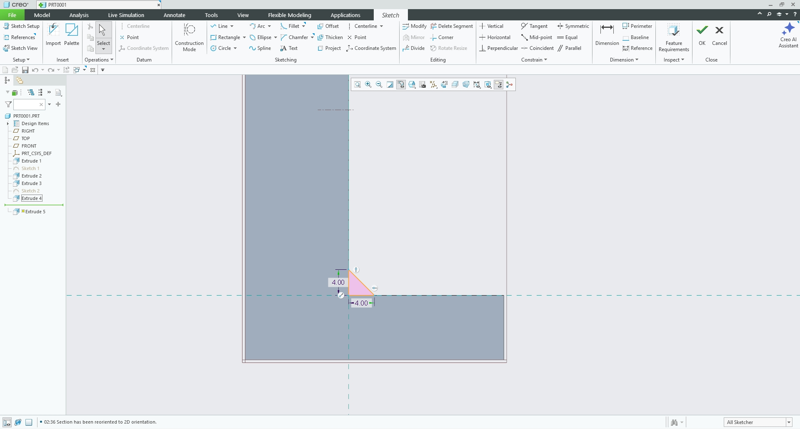
    <figcaption style="font-size: 0.85em; color: gray; margin-top: 5px;">
      Symmetrically mirrored gussets
    </figcaption>
  </figure>

  <figure style="display: inline-block; margin: 10px; vertical-align: top;">
    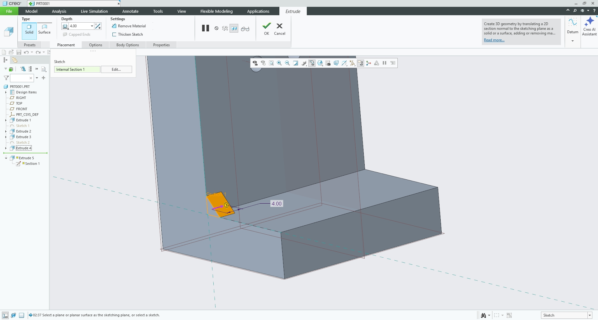
    <figcaption style="font-size: 0.85em; color: gray; margin-top: 5px;">
      Completed L-bracket model with 2 mm stress-relief rounds
    </figcaption>
  </figure>

---

## 3. Manufacturing & Slicing Optimization
Before exporting to the printer, I evaluated how the part sits in PrusaSlicer for the Prusa CORE One.

  <figure style="display: inline-block; margin: 10px; vertical-align: top;">
    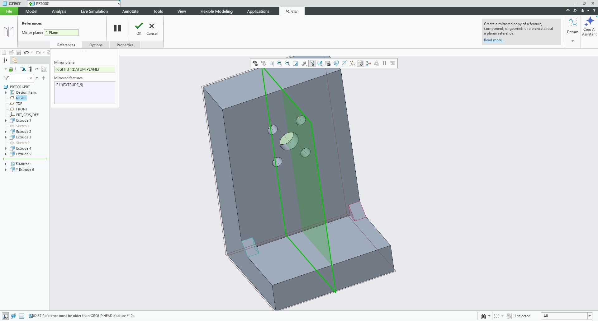
    <figcaption style="font-size: 0.85em; color: gray; margin-top: 5px;">
      Side-orientation print setup in PrusaSlicer
    </figcaption>
  </figure>

Laying the bracket flat on its side aligns the PLA layer lines parallel to the $300\text{ N}$ bending force, completely eliminating delamination risks and removing the need for support material.

  <figure style="display: inline-block; margin: 10px; vertical-align: top;">
    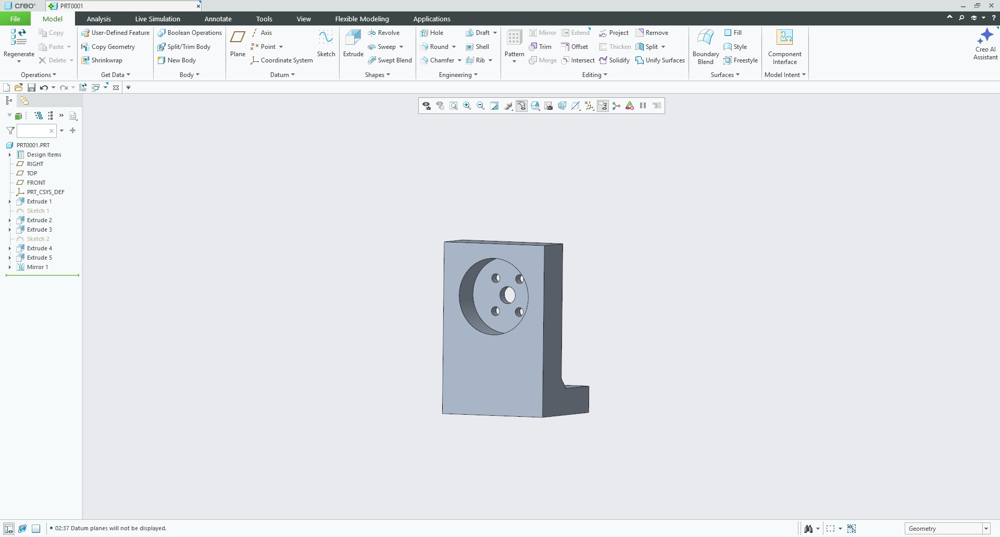
    <figcaption style="font-size: 0.85em; color: gray; margin-top: 5px;">
      Final rendered model showing clean integration of the motor recess and gussets
    </figcaption>
  </figure>

---

## 4. Design Reflection & Analytical Comparison
My initial calculation called for a flat $16\text{ mm}$ wall, but that would have completely swallowed the $18\text{ mm}$ motor shaft. Iterating the model to include a $12\text{ mm}$ deep rear counterbore successfully solved shaft clearance while retaining structural rigidity at the base where bending stresses peak. 

For 3D printed components subjected to bending loads, aligning layer orientation with principal stress paths is just as critical as managing theoretical cross-sectional moments of inertia.

---

## 5. Lessons Learned & Time Tracking
Building this model reinforced the importance of planning feature hierarchies—specifically building the core L-profile before cutting counterbores and holes. Catching the shaft length interference early saved significant remodeling time.

**Time Spent:**
* Hand Calculations & Parameter Setup: 1.0 hour
* PTC Creo Relational Modeling: 1.5 hours
* **Total Time:** 2.5 hours

  
  <!-- PDF Report Download Button -->
  <a href="MEGR 2156 A4.pdf" download="MEGR 2156 A4.pdf" style="
    background-color: #d32f2f; 
    color: white; 
    text-decoration: none;
    padding: 12px 22px; 
    font-size: 0.95em; 
    font-weight: bold; 
    border-radius: 5px; 
    box-shadow: 0 2px 5px rgba(0,0,0,0.15);
    display: inline-block;
    transition: background-color 0.2s;">
    📕 Download Hand Calculations PDF
  </a>

  <!-- CAD File Download Button -->
  <a href="motor_mount.prt.1" download="motor_mount.prt.1" style="
    background-color: #f57c00; 
    color: white; 
    text-decoration: none;
    padding: 12px 22px; 
    font-size: 0.95em; 
    font-weight: bold; 
    border-radius: 5px; 
    box-shadow: 0 2px 5px rgba(0,0,0,0.15);
    display: inline-block;
    transition: background-color 0.2s;">
    📦 Download CAD File .prt
  </a>

## Resources
All design, slicing, and documentation work was done using:

<ul style="list-style-type: circle !important; padding-left: 20px;">
  <li style="list-style-type: circle !important; margin-bottom: 4px;">
    PTC Creo Parametric
  </li>
  <li style="list-style-type: circle !important; margin-bottom: 4px;">
    PrusaSlicer & Prusa CORE One
  </li>
  

  <li style="list-style-type: circle !important; margin-bottom: 4px;">
    Machinery's Handbook (Beam Deflection & Formulas)
  </li>
</ul>
