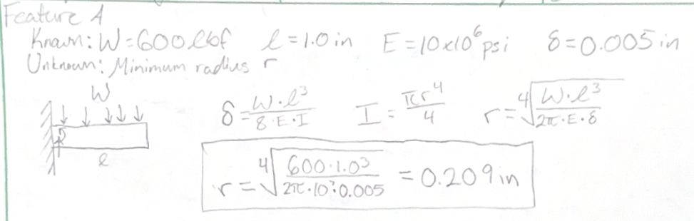
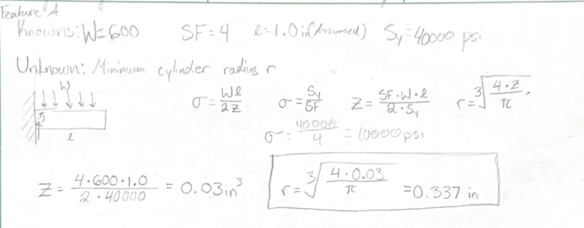
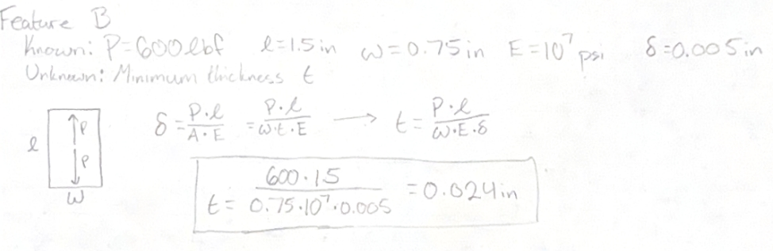
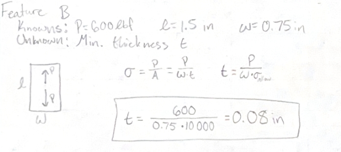
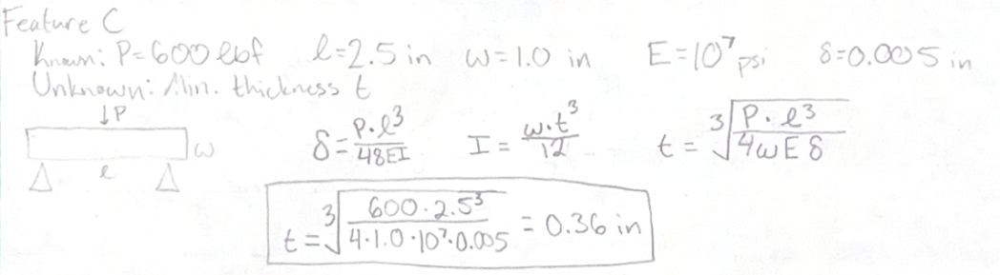
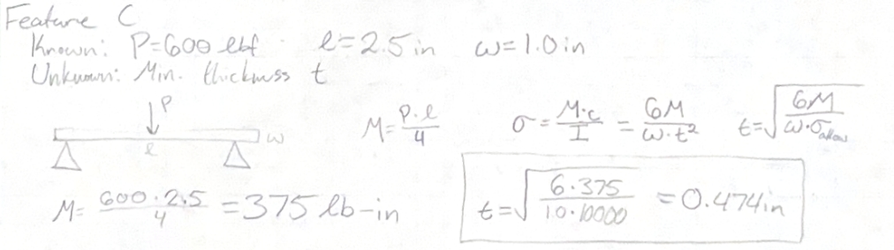
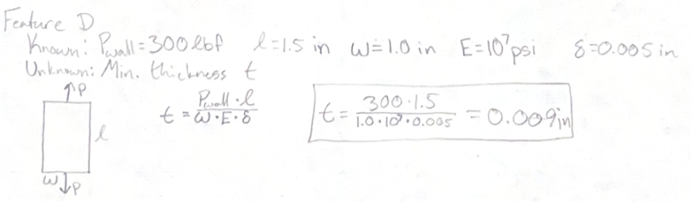
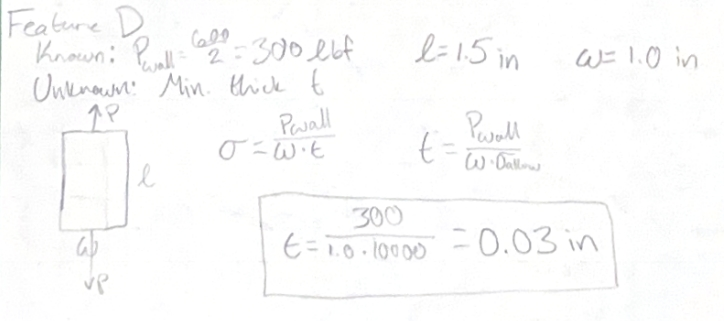
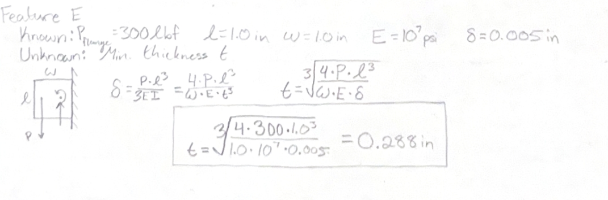
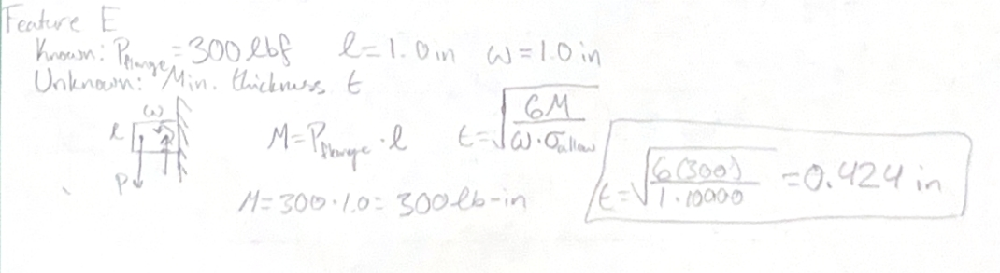

# A5: Bracket Design

<small>***(Clicking on the images will enlarge them)***</small>

## 1. Global Parameters & Load Assumptions
For this assignment, I designed a structural bracket to secure a polyester strap to a rigid T-beam. The design required tracking the load path through five distinct features (A through E), passing reaction forces sequentially. 

**Global Constraints:**  
*   **Material:** Aluminum 6061-T6 ($S_y = 40,000\text{ psi}$, $E = 10 \times 10^6\text{ psi}$)  
*   **Applied Load:** $W = 600\text{ lbf}$ (Satisfying the $500 < F < 800\text{ lbf}$ requirement)  
*   **Safety Factor:** $SF = 4$ ($\sigma_{allow} = 10,000\text{ psi}$)  
*   **Deflection Limit:** $\delta = 0.005\text{ in}$ maximum per feature  
*   **Assumption:** Shear deflections are negligible, and loads split symmetrically through the side walls.  

---

## 2. Analytical Formulation: Stress vs. Stiffness

### Feature A: Strap Frame Cylinder (Cantilever Bending)
The cylinder acts as a cantilever beam subjected to a uniformly distributed load $W$. 

**Strength (Stress) Calculation:**
The stress at the support is $\sigma = \frac{W l}{2 Z}$. Setting $\sigma = \frac{S_y}{SF}$, the required section modulus and minimum radius $r$ for a solid circular cross-section ($Z = \frac{\pi r^3}{4}$) is derived as:
$$Z = \frac{4 \cdot 600\text{ lbf} \cdot 1.0\text{ in}}{2 \cdot 40,000\text{ psi}} = 0.03\text{ in}^3 \implies r = \sqrt[3]{\frac{4 \cdot 0.03}{\pi}} = 0.337\text{ in}$$

**Stiffness (Deflection) Calculation:**
To limit deflection to $\delta = 0.005\text{ in}$ using $\delta = \frac{W l^3}{8 E I}$:
$$r = \sqrt[4]{\frac{600 \cdot (1.0)^3}{2\pi \cdot 10^7 \cdot 0.005}} = 0.209\text{ in}$$
*Result: Stress governs. Minimum safe radius is $0.337\text{ in}$.*

  <figure style="display: inline-block; margin: 10px; vertical-align: top;">
    
    <figcaption style="font-size: 0.85em; color: gray; margin-top: 5px;">
      Feature A: Free Body Diagram & Stress Calculations
    </figcaption>
  </figure>
  <figure style="display: inline-block; margin: 10px; vertical-align: top;">
    
    <figcaption style="font-size: 0.85em; color: gray; margin-top: 5px;">
      Feature A: Deflection & Stiffness Calculations
    </figcaption>
  </figure>

### Feature B: Vertical Support Link (Axial Tension)
Acts as a purely axially loaded bar in tension transferring $P = 600\text{ lbf}$ from Feature A.

**Strength Calculation:**
$$t = \frac{P}{w \cdot \sigma_{allow}} = \frac{600\text{ lbf}}{0.75\text{ in} \cdot 10,000\text{ psi}} = 0.080\text{ in}$$

**Stiffness Calculation ($\delta = \frac{P l}{A E}$):**
$$t = \frac{P l}{w \cdot E \cdot \delta} = \frac{600 \cdot 1.5}{0.75 \cdot 10^7 \cdot 0.005} = 0.024\text{ in}$$
*Result: Stress governs. Minimum safe thickness is $0.080\text{ in}$.*

  <figure style="display: inline-block; margin: 10px; vertical-align: top;">
    
    <figcaption style="font-size: 0.85em; color: gray; margin-top: 5px;">
      Feature B: Free Body Diagram & Stress Calculations
    </figcaption>
  </figure>
  <figure style="display: inline-block; margin: 10px; vertical-align: top;">
    
    <figcaption style="font-size: 0.85em; color: gray; margin-top: 5px;">
      Feature B: Deflection & Stiffness Calculations
    </figcaption>
  </figure>

### Feature C: Horizontal Bridge (Simply Supported Bending)
Spanning the T-beam width ($2.5\text{ in}$ total clear span), this feature acts as a simply supported beam taking the concentrated $600\text{ lbf}$ center load from Feature B.

**Strength Calculation (Maximum Moment $M = \frac{P l}{4}$):**
$$M = \frac{600 \cdot 2.5}{4} = 375\text{ lb-in}$$
$$t = \sqrt{\frac{6 \cdot 375}{1.0 \cdot 10,000}} = 0.474\text{ in}$$

**Stiffness Calculation:**
$$t = \sqrt[3]{\frac{600 \cdot (2.5)^3}{4 \cdot 1.0 \cdot 10^7 \cdot 0.005}} = 0.360\text{ in}$$
*Result: Stress governs. Minimum safe thickness is $0.474\text{ in}$.*

  <figure style="display: inline-block; margin: 10px; vertical-align: top;">
    
    <figcaption style="font-size: 0.85em; color: gray; margin-top: 5px;">
      Feature C: Free Body Diagram & Stress Calculations
    </figcaption>
  </figure>
  <figure style="display: inline-block; margin: 10px; vertical-align: top;">
    
    <figcaption style="font-size: 0.85em; color: gray; margin-top: 5px;">
      Feature C: Deflection & Stiffness Calculations
    </figcaption>
  </figure>

### Feature D: Vertical Side Walls (Axial Tension)
The load splits symmetrically into two side walls, subjecting each to an axial tensile load of $P_{wall} = 300\text{ lbf}$.

**Strength Calculation:**
$$t = \frac{P_{wall}}{w \cdot \sigma_{allow}} = \frac{300\text{ lbf}}{1.0\text{ in} \cdot 10,000\text{ psi}} = 0.030\text{ in}$$

**Stiffness Calculation:**
$$t = \frac{P_{wall} \cdot l}{w \cdot E \cdot \delta} = \frac{300 \cdot 1.5}{1.0 \cdot 10^7 \cdot 0.005} = 0.009\text{ in}$$
*Result: Stress governs. Minimum safe thickness is $0.030\text{ in}$.*

  <figure style="display: inline-block; margin: 10px; vertical-align: top;">
    
    <figcaption style="font-size: 0.85em; color: gray; margin-top: 5px;">
      Feature D: Free Body Diagram & Stress Calculations
    </figcaption>
  </figure>
  <figure style="display: inline-block; margin: 10px; vertical-align: top;">
    
    <figcaption style="font-size: 0.85em; color: gray; margin-top: 5px;">
      Feature D: Deflection & Stiffness Calculations
    </figcaption>
  </figure>

### Feature E: Top Flanges (Cantilever Bending)
Each top flange acts as a cantilever beam subjected to a point load of $P_{flange} = 300\text{ lbf}$ at its free edge.

**Strength Calculation ($M = P_{flange} \cdot l = 300\text{ lb-in}$):**
$$t = \sqrt{\frac{6 \cdot 300}{1.0 \cdot 10,000}} = 0.424\text{ in}$$

**Stiffness Calculation ($\delta = \frac{P l^3}{3 E I}$):**
$$t = \sqrt[3]{\frac{4 \cdot 300 \cdot (1.0)^3}{1.0 \cdot 10^7 \cdot 0.005}} = 0.288\text{ in}$$
*Result: Stress governs. Minimum safe thickness is $0.424\text{ in}$.*

  <figure style="display: inline-block; margin: 10px; vertical-align: top;">
    
    <figcaption style="font-size: 0.85em; color: gray; margin-top: 5px;">
      Feature E: Free Body Diagram & Stress Calculations
    </figcaption>
  </figure>
  <figure style="display: inline-block; margin: 10px; vertical-align: top;">
    
    <figcaption style="font-size: 0.85em; color: gray; margin-top: 5px;">
      Feature E: Deflection & Stiffness Calculations
    </figcaption>
  </figure>

---

## 3. Design Representation & Tolerance Setup

### Multiview Sketching (Stress-Driven Design)
Using the governing values from the strength calculations, the physical multiview paper sketches detail the "Stress-Driven" profile (Sketch 1). The design features a heavily reinforced horizontal bridge ($0.474\text{ in}$ thick), thick top flanges ($0.424\text{ in}$ thick), and a solid vertical link ($0.080\text{ in}$ thick). 

### T-Beam Fit Tolerances
To ensure the bracket physically mounts to the T-beam correctly, I utilized the ANSI/ASME Standard Limits and Fits from the *Machinery’s Handbook* to define three distinct fit classes across the upper body dimensions:
*   **Class "a":** Applied to non-essential accuracy clearance zones.
*   **Class "b":** Applied to free-running fit axes for sliding assembly.
*   **Class "c":** Applied where accurate location and minimal play are critical for structural rigidity.

---

## 4. Design Reflection

*   **Governing Failure Mode:** For this Aluminum 6061-T6 bracket under an $SF=4$, **stress governed the final dimension for every single feature**. Because the material has a relatively high Young's Modulus ($10 \times 10^6\text{ psi}$) compared to its allowable yield threshold ($10,000\text{ psi}$), the bracket reaches its yield limit long before it flexes beyond $0.005\text{ in}$.
*   **Error Propagation:** The initial reaction force derived from Feature A ($600\text{ lbf}$) was the lynchpin of the entire bracket. I correctly passed this as a concentrated axial load into Feature B, which then became a concentrated bending load on Feature C. Had I misinterpreted the initial strap load as $600\text{ lbf}$ *per side*, all linear thickness dimensions in bending would have scaled up drastically (by a factor of $\sqrt{2}$).
*   **Assumption Sensitivity:** Assuming Feature A acts as a cantilever beam rather than being supported at both ends increases the maximum bending moment from $\frac{W l}{8}$ to $\frac{W l}{2}$. This conservative assumption drastically increased the required cylinder radius, resulting in a safer but bulkier part.

---

## 5. Lessons Learned & Time Tracking

Catching the exact horizontal span for Feature C was critical. I initially mistakenly used just dimension $b$ ($0.9992\text{ in}$) for the span. Upon re-reviewing the T-beam cross-section, I realized the bridge must clear the *entire* top flat ($a + 2b \approx 2.5\text{ in}$). Failing to catch this would have resulted in a bracket that physically could not slide onto the T-beam.

**Time Spent:**
* Reading Brief & Geometry Setup: 0.5 hours
* Hand Calculations (Stress & Stiffness): 2.0 hours
* FBD & Multiview Sketching: 1.0 hours
* **Total Time:** 3.5 hours

  
  <!-- Embedded PDF Viewer -->
  

    <embed src="A5-Bracket Design.pdf" width="100%" height="500px" type="application/pdf">
  

  <!-- PDF Report Download Button -->
  <a href="A5-Bracket Design.pdf" download="A5_Bracket_Design_Hoang.pdf" style="
    background-color: #d32f2f; 
    color: white; 
    text-decoration: none;
    padding: 12px 22px; 
    font-size: 0.95em; 
    font-weight: bold; 
    border-radius: 5px; 
    box-shadow: 0 2px 5px rgba(0,0,0,0.15);
    display: inline-block;
    transition: background-color 0.2s;">
    📕 Download Hand Calculations & FBDs PDF
  </a>

## Resources
All design and documentation work was completed using:

<ul style="list-style-type: circle !important; padding-left: 20px;">
  <li style="list-style-type: circle !important; margin-bottom: 4px;">
    Machinery's Handbook (ANSI/ASME Standard Limits and Fits)
  </li>
  <li style="list-style-type: circle !important; margin-bottom: 4px;">
    Course Reference Materials (Beam Deflection & Stress Formulas)
  </li>
  

</ul>
