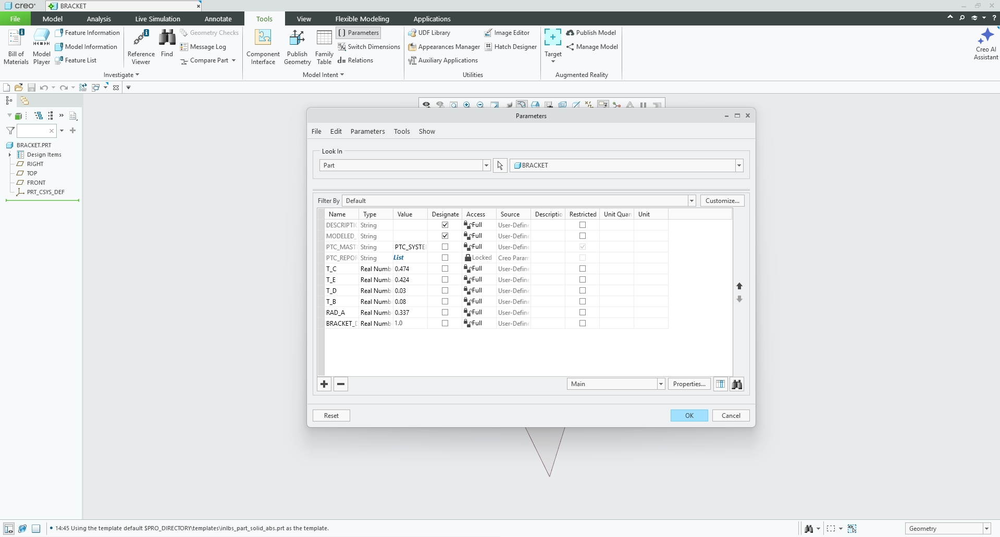
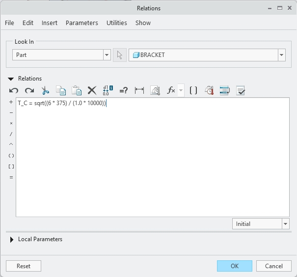
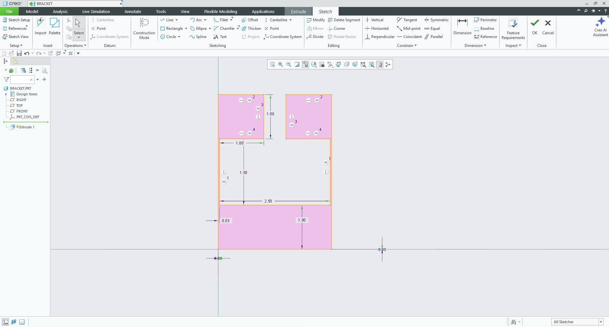
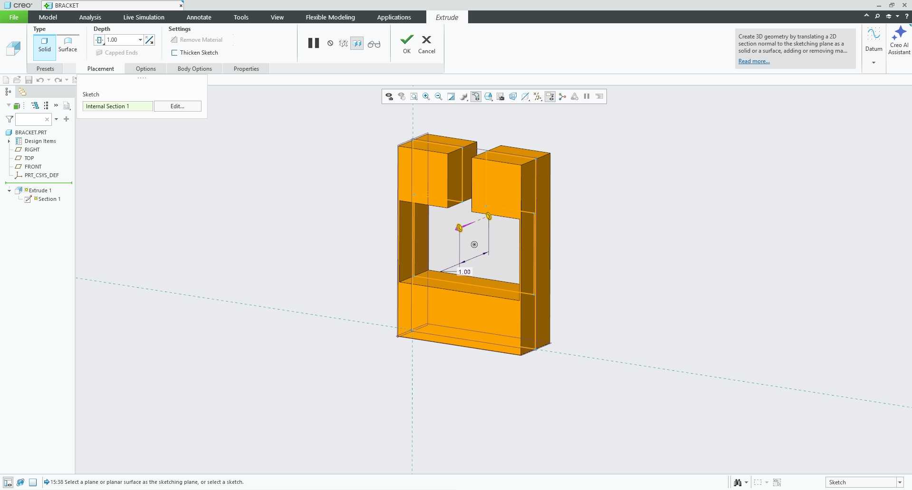
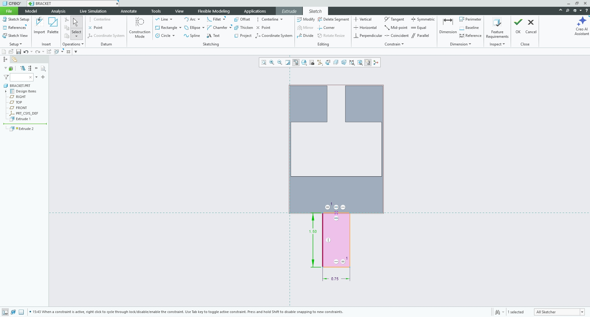
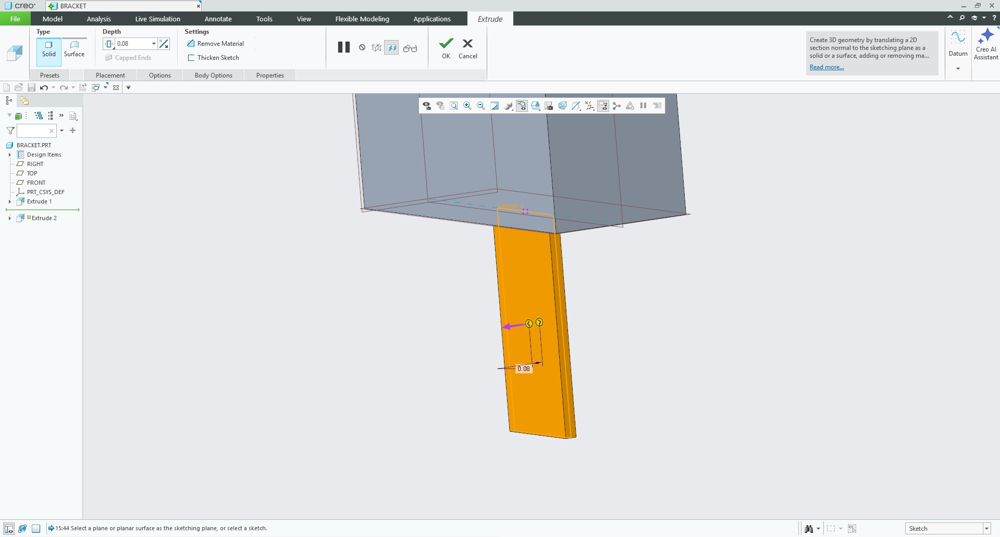
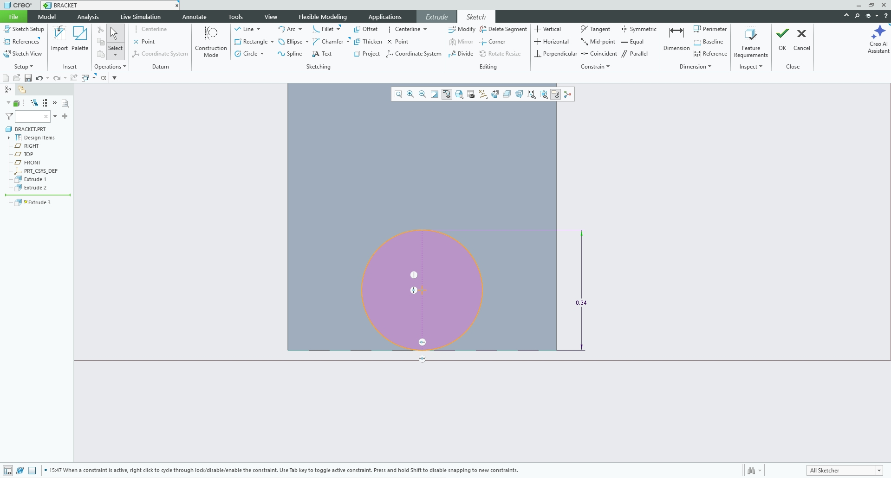
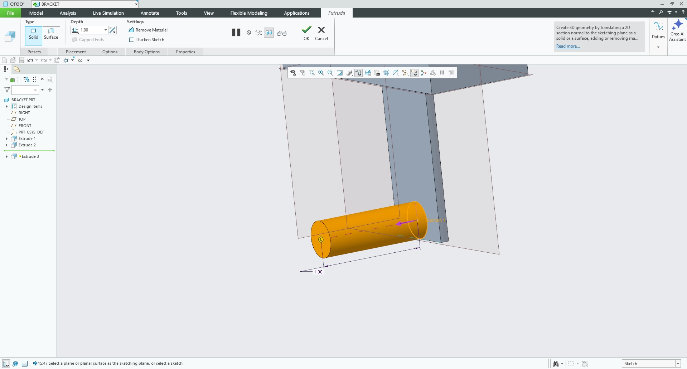
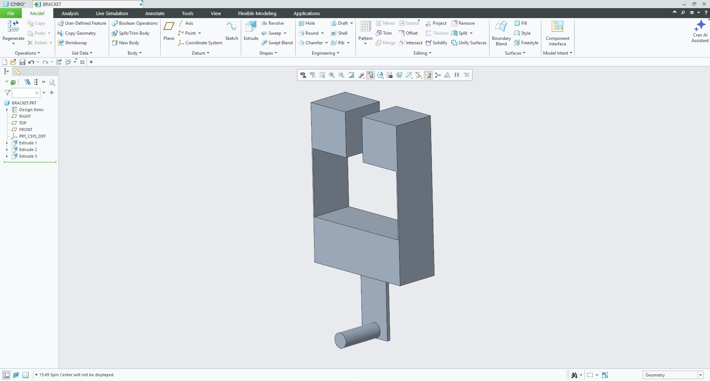
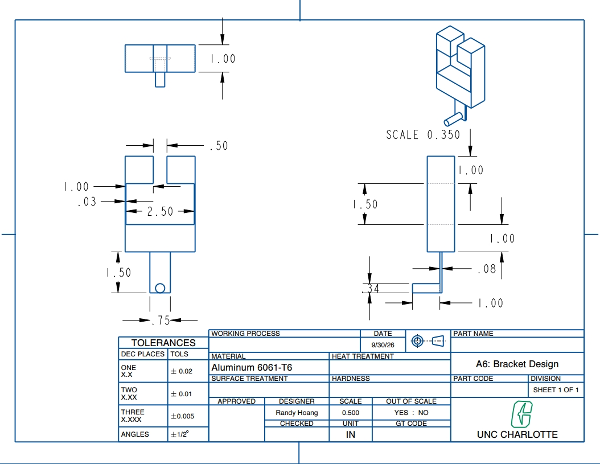

# A6: Bracket Drawing – Design for Strength and Stiffness II

<small>***(Clicking on the images will enlarge them)***</small>

## 1. Parametric Design & Geometry Setup

For this assignment, I designed a parametric upper bracket to interface with a rigid steel T-beam while supporting a $600\text{ lbf}$ cantilevered load from a $3/4\text{ in}$ polyester strap. Aluminum 6061-T6 ($S_y = 40,000\text{ psi}$, $SF = 4$, $\sigma_{\text{allow}} = 10,000\text{ psi}$, $E = 10 \times 10^6\text{ psi}$) was selected for the bracket material. Strength (bending and axial stress) governed the physical sizing for every feature (A through E), as each section reaches its yield stress threshold long before violating the $0.005\text{ in}$ maximum deflection constraint.

### Feature 1: Horizontal Bridge Bending (Feature C)
To calculate the required bridge thickness ($T_C$) under a simply supported bending moment ($M = 375\text{ lb-in}$) across a $1.0\text{ in}$ depth ($b$):
$$t = \sqrt{\frac{6 M}{b \cdot \sigma_{\text{allow}}}} = \sqrt{\frac{6 \cdot 375\text{ lb-in}}{1.0\text{ in} \cdot 10,000\text{ psi}}} = 0.474\text{ in}$$

### Feature 2: Support Link Tension (Feature B)
Under direct axial tension ($P = 600\text{ lbf}$) across a link width ($w = 0.75\text{ in}$):
$$t = \frac{P}{w \cdot \sigma_{\text{allow}}} = \frac{600\text{ lbf}}{0.75\text{ in} \cdot 10,000\text{ psi}} = 0.080\text{ in}$$

### Feature 3: Strap Cylinder Bending (Feature A)
For cantilever bending of the mounting cylinder ($P = 600\text{ lbf}$, moment arm $L = 1.0\text{ in}$):
$$r = \sqrt[3]{\frac{4 M}{\pi \cdot \sigma_{\text{allow}}}} = \sqrt[3]{\frac{4 \cdot 600\text{ lb-in}}{\pi \cdot 10,000\text{ psi}}} = 0.337\text{ in}$$

### Feature 4: Side Wall Tension (Feature D)
Under split axial tension ($P_{\text{wall}} = 300\text{ lbf}$) over depth ($w = 1.0\text{ in}$):
$$t = \frac{300\text{ lbf}}{1.0\text{ in} \cdot 10,000\text{ psi}} = 0.030\text{ in}$$

### Feature 5: Top Flange Bending (Feature E)
For cantilever flange bending ($M = 300\text{ lb-in}$, depth $b = 1.0\text{ in}$):
$$t = \sqrt{\frac{6 M}{b \cdot \sigma_{\text{allow}}}} = \sqrt{\frac{6 \cdot 300\text{ lb-in}}{1.0\text{ in} \cdot 10,000\text{ psi}}} = 0.424\text{ in}$$

---

## 2. CAD Implementation & Parameter Relations

I built the 3D model in PTC Creo Parametric by initializing core parameters and writing the governing equation for Feature C directly into the CAD relations table.

### Step 1: Defining Parameters & Relations
I opened **Tools > Parameters** and established global parameters (`RAD_A`, `T_B`, `T_C`, `T_D`, `T_E`, and `bracket_depth`). In **Tools > Relations**, I linked `T_C` directly to its analytical stress equation.

```text
/* Feature C: Horizontal Bridge Thickness (Simply Supported Bending) */
T_C = sqrt((6 * 375) / (1.0 * 10000))
```

<div align="center">
  <figure style="display: inline-block; margin: 10px; vertical-align: top;">
    
    <figcaption style="font-size: 0.85em; color: gray; margin-top: 5px;">
      Core global parameters established in Creo
    </figcaption>
  </figure>
  <figure style="display: inline-block; margin: 10px; vertical-align: top;">
    
    <figcaption style="font-size: 0.85em; color: gray; margin-top: 5px;">
      Entering analytical stress relation for T_C
    </figcaption>
  </figure>
</div>

### Step 2: Sketching Upper C-Channel Profile
I sketched the symmetric upper channel on the Front Plane, applying equality constraints and binding sketch dimensions directly to parameters `=T_C` ($0.474\text{ in}$), `=T_D` ($0.030\text{ in}$), and `=T_E` ($0.424\text{ in}$).

<div align="center">
  <figure style="display: inline-block; margin: 10px; vertical-align: top;">
    
    <figcaption style="font-size: 0.85em; color: gray; margin-top: 5px;">
      Fully dimensioned symmetric C-channel sketch
    </figcaption>
  </figure>
</div>

### Step 3: Extruding Upper Channel
I extruded the profile using a **Symmetric** depth option bound to `=bracket_depth` ($1.000\text{ in}$).

<div align="center">
  <figure style="display: inline-block; margin: 10px; vertical-align: top;">
    
    <figcaption style="font-size: 0.85em; color: gray; margin-top: 5px;">
      Extruding the channel profile to 1.00 inch depth
    </figcaption>
  </figure>
</div>

### Step 4: Vertical Support Link Extrusion
I selected the bottom face of Feature C, sketched a centered rectangle ($0.750\text{ in}$ width) with thickness bound to `=T_B` ($0.080\text{ in}$), and extruded downward by $1.500\text{ in}$.

<div align="center">
  <figure style="display: inline-block; margin: 10px; vertical-align: top;">
    
    <figcaption style="font-size: 0.85em; color: gray; margin-top: 5px;">
      Sketching vertical link with T_B thickness
    </figcaption>
  </figure>
  <figure style="display: inline-block; margin: 10px; vertical-align: top;">
    
    <figcaption style="font-size: 0.85em; color: gray; margin-top: 5px;">
      Extruding vertical support link downward
    </figcaption>
  </figure>
</div>

### Step 5: Strap Cylinder Post
On the front face of Feature B, I sketched a circular profile bound to `=RAD_A` ($0.337\text{ in}$ radius) at the base and extruded outward by $1.000\text{ in}$ to form the cantilevered mounting cylinder post.

<div align="center">
  <figure style="display: inline-block; margin: 10px; vertical-align: top;">
    
    <figcaption style="font-size: 0.85em; color: gray; margin-top: 5px;">
      Strap cylinder sketch bound to RAD_A parameter
    </figcaption>
  </figure>
  <figure style="display: inline-block; margin: 10px; vertical-align: top;">
    
    <figcaption style="font-size: 0.85em; color: gray; margin-top: 5px;">
      Extruding cantilevered mounting cylinder post
    </figcaption>
  </figure>
</div>

### Step 6: 3D Part Model & 2D Engineering Drawing
With all features constructed, the complete 3D parametric part model was verified in Creo Parametric. I then generated a 2D engineering drawing in **Third-Angle Projection** with Top, Front, Right, and Isometric views, incorporating explicit fit tolerances on mating channels and title block specifications.

<div align="center">
  <figure style="display: inline-block; margin: 10px; vertical-align: top;">
    
    <figcaption style="font-size: 0.85em; color: gray; margin-top: 5px;">
      Final 3D parametric bracket geometry in Creo Parametric
    </figcaption>
  </figure>
  <figure style="display: inline-block; margin: 10px; vertical-align: top;">
    
    <figcaption style="font-size: 0.85em; color: gray; margin-top: 5px;">
      Fully dimensioned multiview drawing with fit tolerances and title block
    </figcaption>
  </figure>
</div>

---

## 3. Tolerancing & Fit Class Integration

The drawing incorporates three distinct ANSI fit classes for the T-slot gap interfacing with the rigid T-beam:

* **Class "a" Fit (Clearance):** Applied to internal vertical slot height to prevent vertical binding.
* **Class "b" Fit (Free-Running):** Applied to internal width between side walls (`T_D`) for smooth axial sliding.
* **Class "c" Fit (Accurate Location):** Applied to top flange gap (`T_E`) for precision alignment under cantilever loading.

```text
UNLESS OTHERWISE SPECIFIED:
DIMENSIONS ARE IN INCHES
TOLERANCES:
X.X   ± .02
X.XX  ± .01
X.XXX ± .005
```

---

## 4. Design Reflection & Analytical Comparison

To drive Feature C (Horizontal Bridge thickness, `T_C`), I used the maximum stress formula for a simply supported beam:
$$t = \sqrt{\frac{6 M}{b \cdot \sigma_{\text{allow}}}}$$

Rather than typing my hand-calculated result ($0.474\text{ in}$) as a static parameter, I entered the mathematical expression directly into Creo's Relations editor (`T_C = sqrt((6 * 375) / (1.0 * 10000))`). When testing a design change by increasing the bending moment to $450\text{ lb-in}$, Creo dynamically updated `T_C` to $0.520\text{ in}$ and regenerated the 3D model automatically without manual sketch editing.

### Fit Tolerances vs. General Block Tolerances
* **Tight Fit ($\text{X.XXX} \pm .005$):** Applied exclusively to mating internal gap dimensions (`T_E` top flange gap) where improper clearance causes mechanical binding or unwanted rotation.
* **Block Tolerances ($\text{X.XX} \pm .01$):** Applied to outer non-mating dimensions (`T_C`, `RAD_A`, `bracket_depth`). Over-specifying tight tolerances on non-mating features dramatically increases machining costs, inspection overhead, and scrap rates without adding structural value.

---

## 5. Lessons Learned & Time Tracking

Anchoring sketch geometry to primary datum planes (Front, Top, Right) rather than fluid geometric edges prevented broken references when parametric values changed. Sizing every feature based on governing stress equations ensured load path continuity across all components.

**Time Spent:**
* Hand Calculations & Parameter Setup: 1.0 hour
* PTC Creo Relational Modeling & Drafting: 2.0 hours
* 2D Multiview Tolerancing & Documentation: 1.5 hours
* **Total Time:** 4.5 hours

<div align="center" style="margin: 25px 0; gap: 12px; display: flex; justify-content: center; flex-wrap: wrap;">

  <!-- PDF Report Download Button -->
  <a href="bracket_drawing.pdf" download="bracket_drawing.pdf" style="
    background-color: #d32f2f; 
    color: white; 
    text-decoration: none;
    padding: 12px 22px; 
    font-size: 0.95em; 
    font-weight: bold; 
    border-radius: 5px; 
    box-shadow: 0 2px 5px rgba(0,0,0,0.15);
    display: inline-block;
    transition: background-color 0.2s;">
    📕 Download Multiview Drawing PDF
  </a>

  <!-- CAD Part File Download Button -->
  <a href="bracket.prt" download="bracket.prt" style="
    background-color: #f57c00; 
    color: white; 
    text-decoration: none;
    padding: 12px 22px; 
    font-size: 0.95em; 
    font-weight: bold; 
    border-radius: 5px; 
    box-shadow: 0 2px 5px rgba(0,0,0,0.15);
    display: inline-block;
    transition: background-color 0.2s;">
    📦 Download CAD Part (.prt)
  </a>

  <!-- CAD Drawing File Download Button -->
  <a href="bracket.drw" download="bracket.drw" style="
    background-color: #1976d2; 
    color: white; 
    text-decoration: none;
    padding: 12px 22px; 
    font-size: 0.95em; 
    font-weight: bold; 
    border-radius: 5px; 
    box-shadow: 0 2px 5px rgba(0,0,0,0.15);
    display: inline-block;
    transition: background-color 0.2s;">
    📐 Download Creo Drawing (.drw)
  </a>

</div>

## Resources

All design, modeling, and documentation work was completed using:

<ul style="list-style-type: circle !important; padding-left: 20px;">
  <li style="list-style-type: circle !important; margin-bottom: 4px;">
    PTC Creo Parametric
  </li>
  <li style="list-style-type: circle !important; margin-bottom: 4px;">
    <a href="[https://www.uline.com/Product/Detail/S-12925/Poly-Cord-Strapping/Heavy-Duty-Polyester-Cord-Strapping-3-4-x-2500](https://www.uline.com/Product/Detail/S-12925/Poly-Cord-Strapping/Heavy-Duty-Polyester-Cord-Strapping-3-4-x-2500)" target="_blank" style="color: inherit; text-decoration: underline;">Uline Heavy-Duty Polyester Cord Strapping Datasheet</a>
  </li>
  <li style="list-style-type: circle !important; margin-bottom: 4px;">
    Machinery's Handbook (Standard Drafting Practices & Machine Fits)
  </li>
  <script>
  MathJax = {
    tex: {
      inlineMath: [['$', '$'], ['\\(', '\\)']]
    }
  };
</script>
<script id="MathJax-script" async
  src="https://cdn.jsdelivr.net/npm/mathjax@3/es5/tex-chtml.js">
</script>
</ul>
